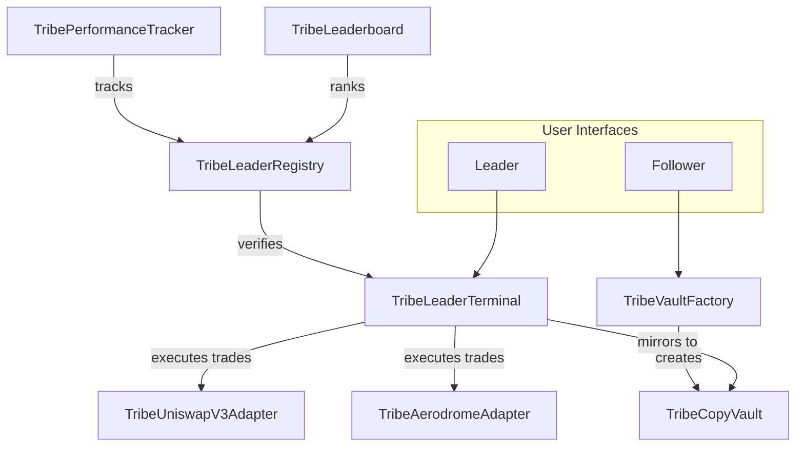
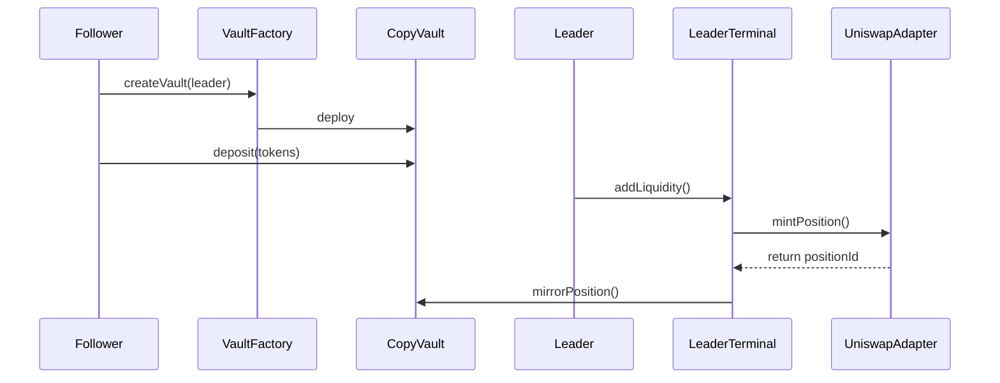
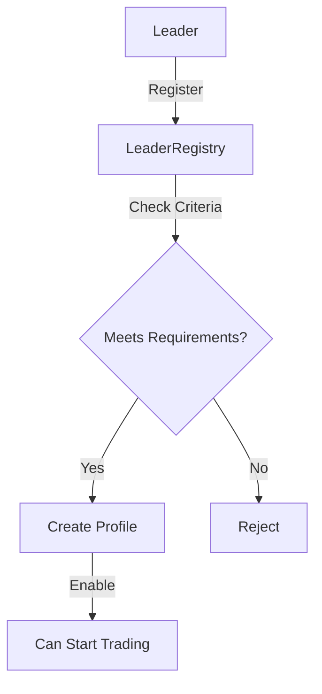
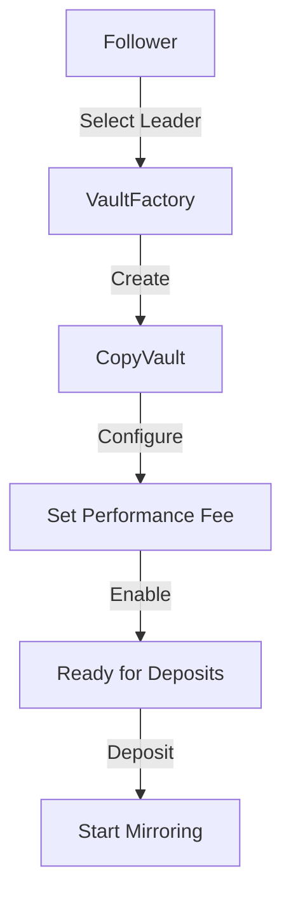
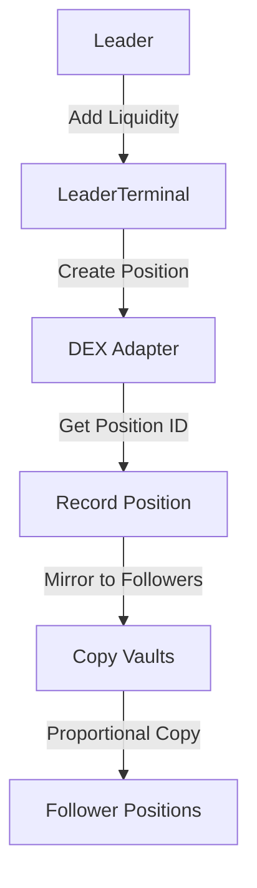
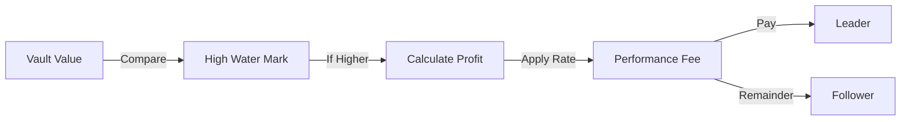
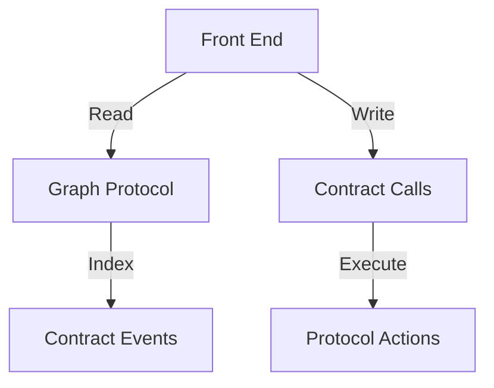
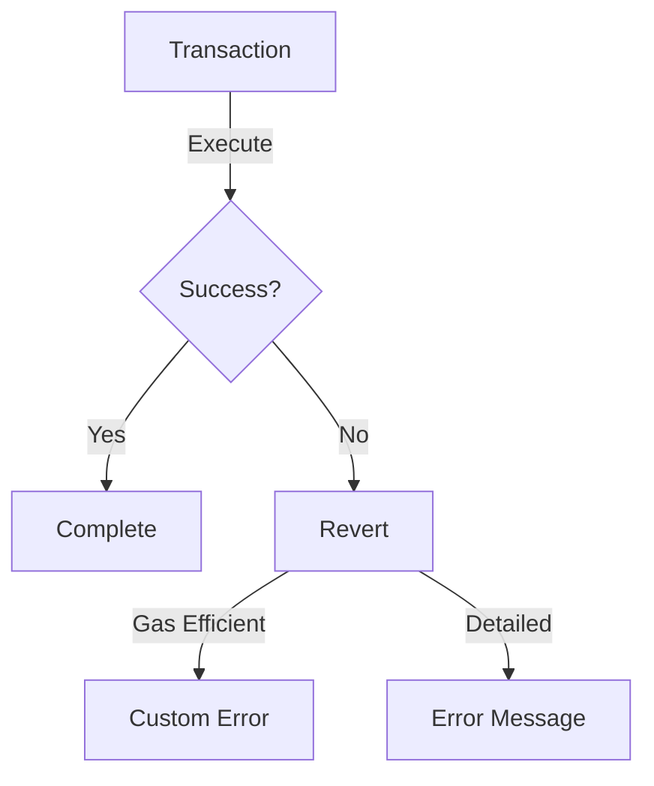

# Tribe Protocol Architecture

## Overview
Tribe Protocol is a decentralized copy trading system that enables followers to automatically mirror the trading positions of successful leaders on decentralized exchanges like Uniswap V3 and Aerodrome.

## Core Components

### 1. Contract Architecture

### 2. Copy Trading Flow

## Contract Roles and Responsibilities

### 1. TribeVaultFactory
- Primary point of vault creation
- Manages mapping of leader-follower relationships
- Tracks all vaults in the system

### 2. TribeCopyVault
- Holds follower funds
- Mirrors leader positions proportionally
- Manages performance fees and high water marks
- Handles deposits and withdrawals

### 3. TribeLeaderTerminal
- Unified entry point for leader actions
- Routes trades to appropriate DEX adapters
- Triggers position mirroring to follower vaults
- Records leader trading history

### 4. TribeLeaderRegistry
- Maintains list of registered leaders
- Enforces leader qualification criteria
- Stores leader metadata and strategies
- Manages leader performance requirements

### 5. Protocol Adapters
#### TribeUniswapV3Adapter
- Interacts with Uniswap V3 position manager
- Handles concentrated liquidity positions
- Manages NFT position creation and management

#### TribeAerodromeAdapter
- Manages Aerodrome LP positions
- Handles stable and volatile pools
- Manages classic AMM liquidity

### 6. TribePerformanceTracker
- Calculates leader profitability
- Tracks historical performance
- Manages performance metrics
- Provides data for leader rankings

### 7. TribeLeaderboard
- Ranks leaders by performance
- Provides discovery mechanism
- Tracks leader statistics

## Key Flows

### 1. Leader Registration Flow

### 2. Follower Onboarding Flow

### 3. Position Management Flow

## Performance Fee Mechanism

## Security Measures
1. **Access Control**
   - Onlyowner modifiers
   - Role-based permissions
   - Terminal-only execution

2. **Fund Safety**
   - Individual vaults per follower
   - Emergency withdrawal mechanism
   - Non-custodial design

3. **Position Management**
   - Proportional mirroring
   - Slippage protection
   - Position verification

## Integration Points

### External Protocols
1. **Uniswap V3**
   - Position Manager
   - Pool Interactions
   - NFT Handling

2. **Aerodrome**
   - Router Integration
   - Pool Management
   - LP Token Handling

### Internal Integration

## Gas Optimization Strategies
1. Position batching
2. Efficient storage patterns
3. Minimal proxy pattern for vaults
4. Optimized approval handling

## Upgradeability
- Adapters are upgradeable
- Core contracts are immutable
- Registry can be extended
- Terminal can add new adapters

## Error Handling

## Event System
- Detailed events for all actions
- Indexed parameters for efficiency
- Graph protocol integration ready
- Complete position tracking